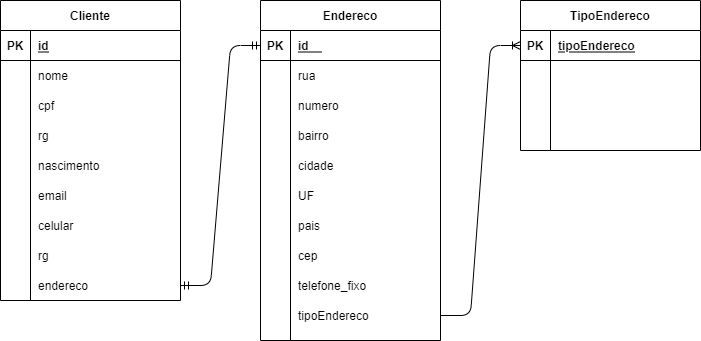

# Acelera Atos - Consumers Api

## Description

API example in the context of consumers.

   

## Features

- 

## Visuals

[Diagram](assets/diagram.drawio)

## Usage

Clone the repository.

## Developers

| [@ev1illyn](https://github.com/ev1illyn) | [@georgemaia](https://github.com/georgemaia) | [@luizcarloscv](https://github.com/luizcarloscv) | [@EzauMartins](https://github.com/EzauMartins) | Ismael Ramos |
| --- | --- | --- | --- | --- | 